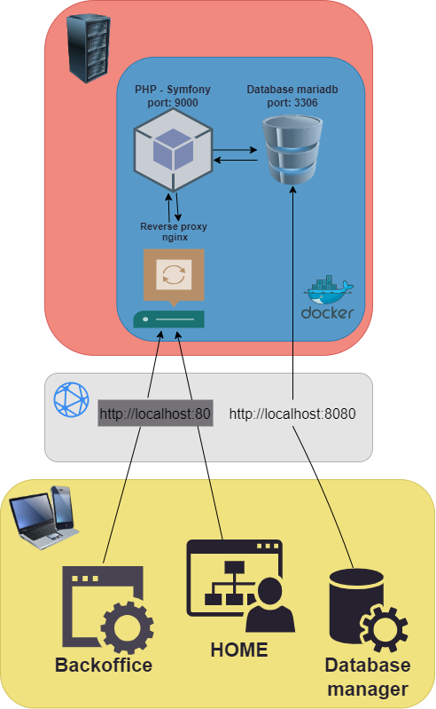

# Cahier des charges techniques

- [Cahier des charges techniques - StudySmart](#cahier-des-charges-techniques-studysmart)
  - [Produit](#produit)
  - [Equipe](#equipe)
  - [Stack](#stack)
  - [Bonnes pratiques](#bonnes-pratiques)
    - [Tests](#tests)
    - [Variable d'environnements](#variable-denvironnements)
    - [CI/CD](#cicd)
    - [Linter](#linter)
    - [Git](#git)
    - [Design Pattern](#design-pattern)
    - [Microservices](#microservices)
  - [Choix techniques](#choix-techniques)
    - [Frontend](#frontend)
    - [Backend](#backend)
  - [Schéma de l'application](#schéma-de-lapplication)
  - [Schéma de la base de données](#schéma-de-la-base-de-données)
  - [Documentation API](#documentation-api)
  - [Outils gestion de projet](#outils-gestion-de-projet)

## Produit

Notre produit est un site web dédié a un entrepreneur souhaitant améliorer sa visibilité sur le web. 

## Equipe

Notre équipe est composée de :

- 1 développeur full stack

## Stack

Notre Stack technique est composée de :

- Frontend : [HTML 5] - [CSS 3(scss)] - [typescript] - [React] 
- Backend : [PHP 8.2] - [Symfony 6.3]
- BDD : [mariadb]
- Ops : [Docker]

## Bonnes pratiques

- Nous utilisons une approche clean code.
- Utilisation de git flow
- Optimisation SEO

### Tests

- Jest 
- PHPUnit 

### Variable d'environnements

Les variables d'environnements sont stockés en local dans un fichier.env

### Git

- Chaque nouvelle feature fait l'object d'une branche
- Quand la feature est terminée, la branche est poussée sur le repo distant
- Une pull request est faite sur la branche develop afin de tester l'application
- La branche develop est mergé dans la branche master une fois les tests terminées

### Design Pattern

- MVC

## Choix techniques

### Frontend

Mes possibilités étaient :

- Front end Vanilla
- [React]
- [Vuejs]
- [stimulus]

| Nom   | Connaissance | Envie | Documentation | Commentaires              |
| ----- | ------------ | ----- | ------------- | ------------------------- |
| vanillaJS | 4/5      | 2/5   | 4/5           | |
| React | 4/5          | 4/5   | 4/5           | |
| Vuejs | 0/5          | 1/5   | 3/5           | Je n'ai jamais utiliser cette technologie |
| stimulus | 3/5       | 0/5   | 1/5           | Déjà utiliser mais peu de doc |

- Je vais implémenter React pour le front de l'application afin de structurer mon code en composants réutilisables.
- Avant de rendre l'application plus robuste, j'utiliserai typescript 
- Utilisation du préprocesseur CSS: Sass permettant d'écrire du code CSS de manière plus efficace, lisible et maintenable

### Backend

Mes possibilités étaient :

- [Node] - [Express]
- PHP

| Nom  | Connaissance | Envie | Documentation | Commentaires             |
| ---- | ------------ | ----- | ------------- | ------------------------ |
| Node | 3/5          | 2/5   | 4/5           |  |
| PHP  | 2/5          | 4/5   | 4/5           | Peu d’expérience sur ce language |

- PHP est bon dans l'intégration avec des bases de données relationnelles.
- Le choix de Symfony était naturelle de part la place qu'il prend dans ma formation studi 
- J'utiliserais l'ORM de symfony:  doctrine pour effectuer les requêtes SQL afin de faciliter et rendre plus lisibles les requêtes vers la base de données.

## Schéma de l'application

## Schéma de la base de données

s

## Documentation API

Voir api.json (Swagger)

## Outils gestion de projet

- Figma
- Trello
- GitHub
- Swagger
